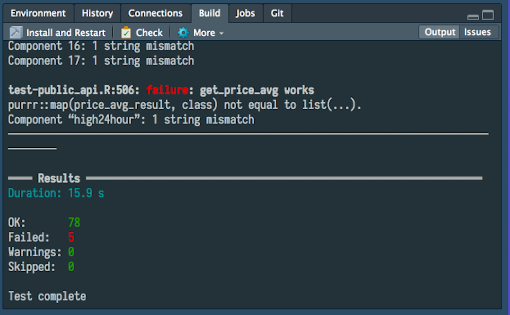

# R Testing in RStudio 1.2

[RStudio 1.2](https://www.rstudio.com/products/rstudio/download/preview/) contains several integrations with [`shinytest`](https://github.com/rstudio/shinytest) and [`testthat`](https://github.com/r-lib/testthat) that make it easier to create, run, and manage tests for R resources (specifically Shiny applications and R packages). 

## shinytest
`shinytest` is a relatively new framework that provides testing for [`shiny`](https://shiny.rstudio.com) applications. It allows the developer of a Shiny application to easily define and run tests around application behavior.

When editing a shiny application, the "Run App" dropdown menu now includes options to "Record Test" and "Run Tests" as shown below. 

Selecting "Record Test" will launch the test recorder application using `shinytest::recordTest()` which will open a new window with the shiny application running alongside a UI built around testing the application. Details about recording tests for Shiny applications can be found [here](https://rstudio.github.io/shinytest/articles/shinytest.html). The "Run Tests" option will open a new tab in the console pane called Tests and run all tests previously recorded for the active application. If there are any failures, they are highlighed in the "Issues" tab of the Tests window. Double clicking an issue will take the user to the test code file that failed.

When an R script defining a shinytest is opened in the source pane, the UI shows options to "Compare Results" or "Run Tests". These R scripts are configured to automatically open at the conclusion of recording a shinytest, and these files are also opened when an issue is double clicked as explained above.

In this case, "Compare Results" will launch a Shiny application in a separate window that highlights the differences noticed between the expected results of the test and the actual results of the most recent test. The user is informed if there are no differences to compare. Selecting "Run Tests" will only run the test defined in the open script, not all tests for the app the script is associated with.

## testthat
`testthat` has been around for a while and is the standard test suite for R packages. The latest RStudio IDE release contains a few integrations with `testthat` that improve the testing experience.

When editing a test script, the source pane displays a button to "Run Tests". When this is selected, the tests for the given package are run in the Build pane. Once the tests are complete, specific failures can be identified and navigated to using the "Issues" tab in the Build pane.

